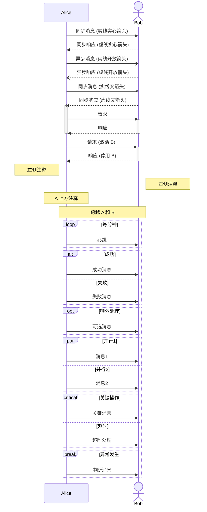

# AI Mermaid Editor (aimermaid) 设计文档

> 版本: 0.1.0  
> 创建日期: 2026-02-05  
> 状态: 开发中

---

## 一、产品概述

**产品名称**: AI Mermaid Editor (aimermaid)

**核心定位**: 一款 VS Code 插件，让用户通过**拖拽方式**可视化编辑 Mermaid 图表，无需手写代码。

**核心功能**:
1. 在 VS Code 中打开 Markdown 文件时，自动识别 ```` ```mermaid ```` 代码块
2. 提供 "可视化编辑" 按钮，点击后打开拖拽编辑器
3. 通过拖拽方式创建和编辑 Mermaid 图表
4. 编辑完成后自动写回 Markdown 文件

---

## 二、技术架构

```
┌─────────────────────────────────────────────────────────────┐
│                      VS Code Extension                       │
├─────────────────────────────────────────────────────────────┤
│                                                              │
│  ┌──────────────┐    ┌──────────────┐    ┌──────────────┐  │
│  │  CodeLens    │    │   Webview    │    │   Parser     │  │
│  │  Provider    │───▶│   Editor     │◀──▶│   Engine     │  │
│  │  (入口按钮)   │    │  (拖拽画布)   │    │ (Mermaid解析) │  │
│  └──────────────┘    └──────────────┘    └──────────────┘  │
│         │                   │                    │          │
│         ▼                   ▼                    ▼          │
│  ┌─────────────────────────────────────────────────────┐   │
│  │              Document Sync Service                   │   │
│  │           (Markdown 文件双向同步)                     │   │
│  └─────────────────────────────────────────────────────┘   │
│                                                              │
└─────────────────────────────────────────────────────────────┘
```

### 2.1 模块职责

| 模块 | 职责 |
|------|------|
| **CodeLens Provider** | 识别 Markdown 中的 mermaid 代码块，显示 "可视化编辑" 按钮 |
| **Webview Editor** | 提供拖拽画布，支持创建参与者、连线、添加注释等操作 |
| **Parser Engine** | 双向解析：Mermaid 代码 ↔ 可视化数据模型 |
| **Document Sync** | 管理与 Markdown 文件的同步，支持保存和撤销 |

---

## 三、技术选型

| 层面 | 技术 | 理由 |
|------|------|------|
| VS Code API | Extension API + Webview | 官方推荐方案 |
| 前端框架 | **React 18** | 组件化、生态丰富 |
| 拖拽引擎 | **@xyflow/react (React Flow)** | 专为节点图设计，支持自定义节点和边 |
| 样式 | **Tailwind CSS** | 快速开发，原子化 CSS |
| 状态管理 | **Zustand** | 轻量、简洁、TypeScript 友好 |
| Mermaid 解析 | **mermaid.js** + 自定义 Parser | 渲染预览 + AST 解析 |
| 图标库 | **Lucide React** | 轻量、风格统一 |
| 构建工具 | **Vite** + **esbuild** | 快速 HMR，高效构建 |
| 语言 | **TypeScript** | 类型安全 |

---

## 四、项目结构

```
aimermaid/
├── package.json                 # VS Code 插件配置 + 依赖
├── tsconfig.json                # TypeScript 配置
├── vite.config.ts               # Vite 构建配置
├── tailwind.config.js           # Tailwind CSS 配置
├── postcss.config.js            # PostCSS 配置
│
├── src/
│   ├── extension/               # VS Code 扩展代码 (Node.js 环境)
│   │   ├── extension.ts         # 插件入口，注册命令和 Provider
│   │   ├── codelens.ts          # CodeLens 提供者，识别 mermaid 块
│   │   ├── webview.ts           # Webview 面板管理
│   │   └── document-sync.ts     # 文档同步服务
│   │
│   ├── webview/                 # React 可视化编辑器 (浏览器环境)
│   │   ├── index.html           # Webview HTML 入口
│   │   ├── main.tsx             # React 入口
│   │   ├── App.tsx              # 主应用组件
│   │   ├── components/          # UI 组件
│   │   │   ├── Canvas/          # 拖拽画布 (React Flow)
│   │   │   ├── Toolbar/         # 左侧工具栏
│   │   │   ├── PropertyPanel/   # 右侧属性面板
│   │   │   └── Preview/         # Mermaid 实时预览
│   │   ├── nodes/               # 自定义 React Flow 节点
│   │   │   ├── ParticipantNode.tsx
│   │   │   └── ...
│   │   ├── edges/               # 自定义 React Flow 边
│   │   │   ├── MessageEdge.tsx
│   │   │   └── ...
│   │   ├── stores/              # Zustand 状态管理
│   │   │   └── diagramStore.ts
│   │   └── utils/               # 工具函数
│   │       ├── mermaid-parser.ts    # Mermaid → Model
│   │       ├── mermaid-generator.ts # Model → Mermaid
│   │       └── vscode-api.ts        # VS Code Webview API 封装
│   │
│   └── shared/                  # 共享代码 (两端通用)
│       ├── types.ts             # 类型定义
│       └── constants.ts         # 常量定义
│
├── dist/                        # 构建产物
│   ├── extension/               # 扩展代码
│   └── webview/                 # Webview 资源
│
└── docs/                        # 文档
    └── DESIGN.md                # 本设计文档
```

---

## 五、核心数据模型

### 5.1 时序图数据模型

```typescript
// 参与者
interface Participant {
  id: string;
  name: string;           // 显示名称
  alias?: string;         // 别名 (participant A as "User")
  type: 'participant' | 'actor';
  order: number;          // 排列顺序
}

// 消息
interface Message {
  id: string;
  from: string;           // 发送者 ID
  to: string;             // 接收者 ID
  text: string;           // 消息文本
  type: MessageType;
  order: number;          // 消息顺序
}

type MessageType = 
  | 'sync'          // ->>  实线箭头
  | 'syncDotted'    // -->> 虚线箭头
  | 'asyncOpen'     // -)   实线开放箭头
  | 'asyncDotted'   // --)  虚线开放箭头
  | 'syncCross'     // -x   实线叉箭头
  | 'syncDottedCross'; // --x 虚线叉箭头

// 注释
interface Note {
  id: string;
  text: string;
  position: 'left' | 'right' | 'over';
  participantIds: string[];  // 关联的参与者
  order: number;
}

// 激活框
interface Activation {
  id: string;
  participantId: string;
  startMessageId: string;
  endMessageId: string;
}

// 分组块 (loop, alt, opt, par, etc.)
interface Block {
  id: string;
  type: 'loop' | 'alt' | 'else' | 'opt' | 'par' | 'critical' | 'break';
  label: string;
  messageIds: string[];    // 包含的消息 ID
  children?: Block[];      // 嵌套块
}

// 完整时序图
interface SequenceDiagram {
  participants: Participant[];
  messages: Message[];
  notes: Note[];
  activations: Activation[];
  blocks: Block[];
}
```

### 5.2 React Flow 节点映射

| 时序图元素 | React Flow 表示 |
|-----------|----------------|
| Participant | 自定义节点 `ParticipantNode` |
| Message | 自定义边 `MessageEdge` |
| Note | 自定义节点 `NoteNode` |
| Block (loop/alt) | 自定义节点 `BlockNode` (背景框) |

---

## 六、用户交互流程

### 6.1 主流程

```
用户打开 .md 文件
       │
       ▼
检测到 ```mermaid 代码块
显示 [🎨 可视化编辑] 按钮 (CodeLens)
       │
       │ 用户点击按钮
       ▼
┌─────────────────────────────────────────┐
│         Webview 可视化编辑器             │
│                                         │
│  1. 解析 Mermaid 代码 → 数据模型         │
│  2. 渲染到 React Flow 画布              │
│  3. 用户拖拽编辑                         │
│  4. 实时预览 Mermaid 渲染结果            │
│                                         │
│  [保存并关闭] [取消]                     │
└─────────────────────────────────────────┘
       │
       │ 用户点击保存
       ▼
数据模型 → Mermaid 代码
       │
       ▼
自动更新 Markdown 文件中的 mermaid 代码块
```

### 6.2 编辑器界面布局

```
┌──────────────────────────────────────────────────────────────┐
│  工具栏: [保存] [撤销] [重做] [缩放+] [缩放-] [适应] [预览☑]  │
├──────────┬────────────────────────────────┬──────────────────┤
│          │                                │                  │
│  元素    │         拖拽画布                │    属性面板      │
│  工具箱   │                                │                  │
│          │    ┌─────┐       ┌─────┐       │  选中: 消息      │
│ ┌──────┐ │    │User │──────▶│Server│      │  ─────────────   │
│ │参与者│ │    └─────┘       └─────┘       │  文本: Hello     │
│ └──────┘ │         │             │        │  类型: [sync ▼]  │
│ ┌──────┐ │         ◀────────────┘        │                  │
│ │ 消息 │ │                                │                  │
│ └──────┘ │                                │                  │
│ ┌──────┐ │                                │                  │
│ │ 注释 │ │                                │                  │
│ └──────┘ │                                │                  │
│ ┌──────┐ │                                │                  │
│ │ 循环 │ │                                │                  │
│ └──────┘ │                                │                  │
│ ┌──────┐ │                                │                  │
│ │ 分支 │ │                                │                  │
│ └──────┘ │                                │                  │
│          │                                │                  │
├──────────┴────────────────────────────────┴──────────────────┤
│  代码预览 (可折叠):                                           │
│  sequenceDiagram                                              │
│      participant User                                         │
│      participant Server                                       │
│      User->>Server: Hello                                     │
│      Server-->>User: Hi                                       │
└──────────────────────────────────────────────────────────────┘
```

---

## 七、时序图编辑器详细设计

### 7.1 支持的元素

| 元素类型 | 拖拽/操作方式 | Mermaid 语法 |
|---------|-------------|-------------|
| 参与者 (Participant) | 从工具栏拖入画布 | `participant A` |
| 角色 (Actor) | 从工具栏拖入画布 | `actor A` |
| 同步消息 | 从参与者 A 拖线到 B | `A->>B: message` |
| 异步消息 | 连线时选择类型 | `A-->>B: message` |
| 自调用 | 从参与者拖回自身 | `A->>A: self call` |
| 激活框 | 双击参与者开启 | `activate A` / `deactivate A` |
| 注释 (Note) | 从工具栏拖入 | `Note over A: text` |
| 循环 (Loop) | 框选消息区域 | `loop condition ... end` |
| 条件分支 (Alt) | 框选消息区域 | `alt condition ... else ... end` |
| 可选 (Opt) | 框选消息区域 | `opt condition ... end` |
| 并行 (Par) | 框选消息区域 | `par ... and ... end` |

### 7.2 消息类型

| 类型 | 符号 | 描述 |
|------|------|------|
| 同步实线 | `->>` | 实线，实心箭头 |
| 同步虚线 | `-->>` | 虚线，实心箭头 |
| 异步实线 | `-)` | 实线，开放箭头 |
| 异步虚线 | `--)` | 虚线，开放箭头 |
| 同步叉实线 | `-x` | 实线，叉箭头 |
| 同步叉虚线 | `--x` | 虚线，叉箭头 |

### 7.3 交互细节

| 操作 | 行为 |
|------|------|
| 拖拽参与者 | 水平移动，改变排列顺序 |
| 拖拽消息 | 垂直移动，改变消息顺序 |
| 双击文本 | 进入编辑模式 |
| Delete 键 | 删除选中元素 |
| Ctrl+Z | 撤销 |
| Ctrl+Y | 重做 |
| 鼠标滚轮 | 缩放画布 |
| 空格+拖拽 | 平移画布 |

---

## 八、通信协议

### 8.1 Extension ↔ Webview 消息

```typescript
// Extension → Webview
type ExtensionMessage =
  | { type: 'init'; data: { mermaidCode: string; theme: string } }
  | { type: 'themeChanged'; data: { theme: string } };

// Webview → Extension
type WebviewMessage =
  | { type: 'save'; data: { mermaidCode: string } }
  | { type: 'cancel' }
  | { type: 'ready' };
```

---

## 九、开发路线图

### Phase 1: 基础框架 ✅ (进行中)
- [x] 项目结构搭建
- [ ] VS Code 插件骨架
- [ ] CodeLens 识别 mermaid 代码块
- [ ] 基础 Webview 容器
- [ ] Extension ↔ Webview 通信

### Phase 2: 时序图编辑器核心
- [ ] 数据模型和类型定义
- [ ] Mermaid 解析器 (代码 → 模型)
- [ ] Mermaid 生成器 (模型 → 代码)
- [ ] 参与者节点拖拽创建
- [ ] 消息连线绘制
- [ ] 实时预览

### Phase 3: 完善功能
- [ ] 注释节点
- [ ] 激活框
- [ ] 循环/分支块
- [ ] 撤销/重做
- [ ] 属性面板编辑
- [ ] 文档自动同步

### Phase 4: 扩展其他图表 (后续)
- [ ] 流程图 (Flowchart)
- [ ] 类图 (Class Diagram)
- [ ] 状态图 (State Diagram)
- [ ] 甘特图 (Gantt)
- [ ] 饼图 (Pie)
- [ ] ...

---

## 十、风险与应对

| 风险 | 影响 | 应对策略 |
|------|------|---------|
| Mermaid 语法复杂 | 解析困难 | 分阶段实现，先时序图；使用正则+状态机解析 |
| 双向解析保真度 | 编辑后代码格式变化 | 定义规范的代码生成格式，提供格式化选项 |
| Webview 性能 | 大图卡顿 | React Flow 虚拟化；限制元素数量提示 |
| 复杂嵌套块 | 难以可视化 | 简化 UI，嵌套层级限制；提供代码编辑模式 |
| 用户体验一致性 | 与 VS Code 风格不符 | 使用 VS Code 官方 UI 工具包色彩 |

---

## 十一、参考资料

- [Mermaid 官方文档](https://mermaid.js.org/)
- [VS Code Extension API](https://code.visualstudio.com/api)
- [React Flow 文档](https://reactflow.dev/)
- [Zustand 文档](https://zustand-demo.pmnd.rs/)

---

## 附录 A: Mermaid 时序图语法参考


