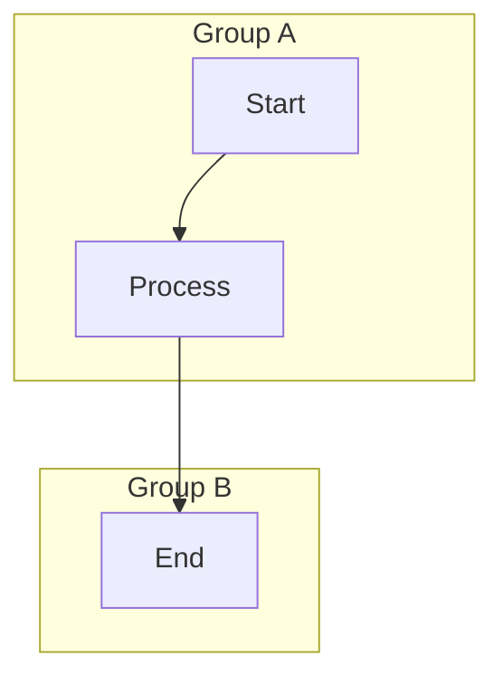

# Swimlane Diagram (Flowchart Subgraph) Design

## 1. Overview
The **Swimlane Diagram** in `aimermaid` provides a visual interface for Mermaid's **Flowchart Subgraph** syntax. It allows users to organize nodes into logical groups (swimlanes/containers).

**Key User Decisions:**
- **Mode**: Free Grouping (Subgraphs can be placed anywhere, not just strictly as lanes).
- **Interaction**: Container-based (Drag node in -> Groups it; Drag Swimlane -> Moves content).
- **Sizing**: Manual Resizing supported (via spacer nodes).
- **Structure**: Single-layer (No nested subgraphs for MVP).

## 2. Mermaid Syntax Support

Target Syntax:


## 3. User Experience (UX)

### 3.1. Visual Elements
- **Swimlane/Subgraph Node**: 
  - A container box with a header (Title).
  - **Resize Handles**: Visible on selection (Right/Bottom edges) to manually adjust size.
  - **Style**: Dashed/Solid border, customizable background color.
- **Content Nodes**: Standard Flowchart nodes inside the box.

### 3.2. Creating & Grouping (Container Mode)
- **Add Subgraph**: Drag "Group/Swimlane" tool from toolbar to canvas.
- **Group Node**: 
  - Drag an existing node *into* the Subgraph box.
  - Visual feedback: Subgraph highlights to indicate "Ready to accept".
  - **Result**: Node becomes a child of the Subgraph (moves with it). Code updates to place node inside `subgraph` block.
- **Ungroup Node**:
  - Drag a node *out* of the Subgraph box to the main canvas.
  - **Result**: Node becomes independent. Code moves node outside `subgraph` block.

### 3.3. Sizing & Layout (Manual + Spacer Strategy)
- **Auto-Expand**: The Subgraph will always be *at least* large enough to fit its content.
- **Manual Resize**: 
  - Users can drag resize handles to make the Subgraph *larger* than its content (e.g., to create empty space).
  - **Technical Implementation**: 
    - Since Mermaid auto-shrinks subgraphs, we will insert an **invisible spacer node** (`~~~` edge to a hidden node) at the desired bottom-right position if the user manually expands the box.
    - This forces the layout engine to respect the user's manual size.

### 3.4. Limitations (MVP)
- **Single Layer**: Dropping a Subgraph inside another Subgraph is disabled.
- **Free Layout**: Subgraphs are treated as independent boxes, not enforced rows/columns. Users must align them manually if they want a grid.

## 4. Technical Architecture

### 4.1. Data Model Updates
Extend `FlowchartDiagram`:

```typescript
export interface FlowchartDiagram {
  // ... existing fields
  subgraphs: FlowSubgraph[]; // Explicit list of subgraphs
}

export interface FlowSubgraph {
  id: string;
  title: string;
  nodeIds: string[]; // List of nodes contained in this subgraph
  manualWidth?: number; // For spacer calculation
  manualHeight?: number;
  style?: string; // mermaid style string
}
```

### 4.2. React Flow Implementation
- **Custom Node: `SubgraphNode`**:
  - **Type**: `subgraph`.
  - **Component**: Renders a `div` container.
  - **Z-Index**: `-1` (always behind content nodes).
  - **Interaction**: 
    - `onNodeDrag`: Updates positions of all child nodes (delta).
    - `onResize`: Updates `manualWidth/Height`.
- **Node Parenting**:
  - Use React Flow's `parentNode` property.
  - `extent: 'parent'` is **NOT** used because we allow dragging out. Instead, we detect `onNodeDragStop`:
    - If dropped *on* a Subgraph -> Set `parentNode`.
    - If dropped *on canvas* -> Clear `parentNode`.

### 4.3. Parser Logic (`mermaid-parser.ts`)
1.  **Regex Strategy**:
    - Identify `subgraph id [Title] ... end` blocks.
    - Parse nodes defined *inside* the block -> Assign to Subgraph.
    - Parse nodes defined *outside* -> Root level.
    - *Spacer Detection*: Ignore nodes ending in `_spacer` or marked with specific styles.

### 4.4. Generator Logic (`mermaid-generator.ts`)
1.  Iterate `diagram.subgraphs`.
2.  Start `subgraph id [Title]`.
3.  Write all nodes where `node.parentId === subgraph.id`.
4.  **Spacer Injection**:
    - If `manualWidth/Height` is set, calculate the relative position of the bottom-right corner.
    - Generate: `NodeLast ~~~ SubgraphSpacer[ ]:::hidden`
    - Add classDef for hidden: `classDef hidden display:none,width:0px;`
5.  End `end`.
6.  Write edges.

## 5. Development Phases

1.  **Core Flowchart**: Rendering basic nodes/edges (Prerequisite).
2.  **Subgraph Container**: 
    - Add `SubgraphNode`.
    - Implement "Drag to Group" detection.
3.  **Manual Sizing**:
    - Implement Resize handles.
    - Implement Spacer Node generation logic.
4.  **Parser/Generator**: Full round-trip support for `subgraph`.

## 6. Edge Cases & Risks
- **Mermaid Layout Conflict**: `dagre` (Mermaid's engine) might re-arrange nodes inside the subgraph, ignoring our manual X/Y positions.
  - *Mitigation*: We only sync *topology* (grouping) to Mermaid. Visual positions in React Flow are local. When reloading from Mermaid, layout might reset. **User expectation management: "Auto-layout on code change".**
