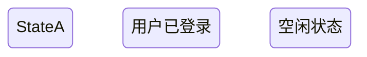
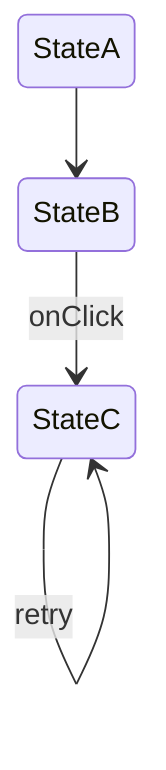
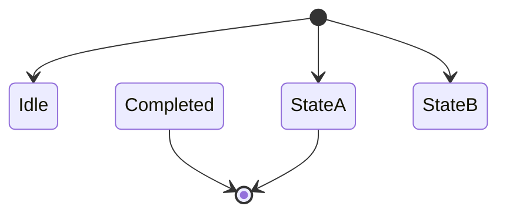
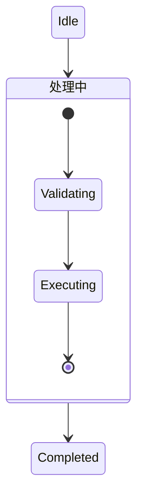
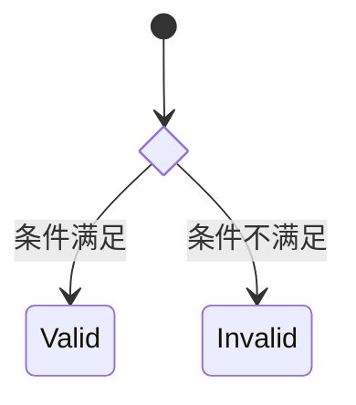
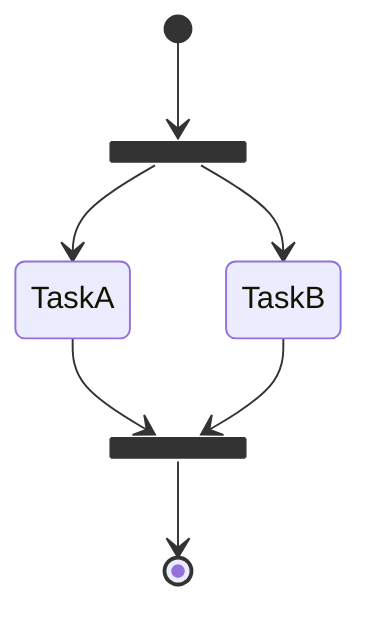
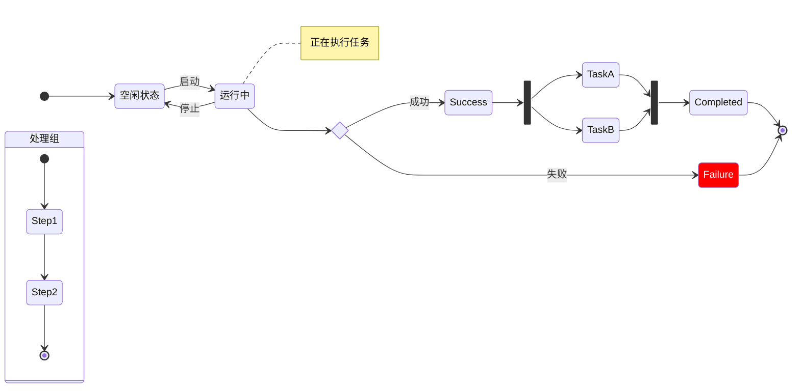

# 状态机图 (State Diagram) 设计文档

> 版本: 0.1.0  
> 创建日期: 2026-02-08  
> 状态: 设计阶段

---

## 一、概述

### 1.1 功能目标

为 AI Mermaid Editor 添加状态机图可视化编辑功能，支持用户通过拖拽方式创建和编辑 Mermaid 状态图。

### 1.2 设计原则

1. **完全兼容 Mermaid 语法** - 仅支持 Mermaid 官方文档定义的状态图语法
2. **复用现有架构** - 最大程度复用时序图的基础设施
3. **图表类型隔离** - 状态图和时序图使用独立的组件和 Store

---

## 二、Mermaid 状态图语法分析

### 2.1 支持的语法特性 (按优先级排序)

#### Phase 1: 核心功能 (必须实现)

| 特性 | 语法示例 | 说明 |
|------|----------|------|
| **状态声明** | `stateId` | 简单状态，仅 ID |
| **状态描述** | `state "描述文本" as stateId` | 带描述的状态 |
| **状态描述 (简写)** | `stateId : 描述文本` | 冒号语法 |
| **状态转换** | `State1 --> State2` | 基本转换 |
| **带标签转换** | `State1 --> State2 : 事件名` | 带事件/条件的转换 |
| **开始状态** | `[*] --> FirstState` | 初始状态 |
| **结束状态** | `FinalState --> [*]` | 终止状态 |
| **方向设置** | `direction LR` / `direction TB` | 图表布局方向 |

#### Phase 2: 高级功能

| 特性 | 语法示例 | 说明 |
|------|----------|------|
| **复合状态** | `state StateGroup { ... }` | 包含内部状态的组合状态 |
| **选择节点** | `state check <<choice>>` | 条件分支点 |
| **分叉节点** | `state fork_state <<fork>>` | 并行分支开始 |
| **汇合节点** | `state join_state <<join>>` | 并行分支合并 |
| **注释** | `note right of State1 : text` | 单行注释 |
| **多行注释** | `note right of State1` + `end note` | 多行注释块 |

#### Phase 3: 扩展功能 (可选)

| 特性 | 语法示例 | 说明 |
|------|----------|------|
| **并发区域** | `state Concurrent { ... -- ... }` | 并行执行区域 |
| **样式定义** | `classDef styleName fill:#f00` | 自定义样式 |
| **样式应用** | `class StateName styleName` | 应用样式 |
| **内联样式** | `StateName:::styleName` | 内联样式应用 |

### 2.2 语法细节

#### 2.2.1 状态声明



**解析规则**:
- 状态 ID: 字母开头，可包含字母、数字、下划线
- 描述文本: 任意字符串，用引号包裹或冒号后跟随

#### 2.2.2 状态转换



**解析规则**:
- 转换箭头: `-->`
- 标签: 冒号 `:` 后的文本

#### 2.2.3 特殊状态



**解析规则**:
- `[*]` 在源位置 = 开始状态
- `[*]` 在目标位置 = 结束状态

#### 2.2.4 复合状态



**解析规则**:
- `state stateId { ... }` 定义复合状态
- 复合状态内可包含完整的状态机
- 支持嵌套（复合状态内的复合状态）

#### 2.2.5 选择节点 (Choice)



**解析规则**:
- `<<choice>>` 修饰符标记选择节点
- 选择节点通常有多个出边

#### 2.2.6 分叉与汇合 (Fork/Join)



**解析规则**:
- `<<fork>>` 标记分叉节点（一入多出）
- `<<join>>` 标记汇合节点（多入一出）

#### 2.2.7 注释

```mermaid
stateDiagram-v2
    State1 : 运行中
    note right of State1 : 这是一个注释
    
    note left of State2
        这是多行注释
        可以写很多内容
    end note
```

**解析规则**:
- 单行注释: `note [left|right] of StateId : text`
- 多行注释: `note [left|right] of StateId` + 换行 + 内容 + `end note`

#### 2.2.8 方向

```mermaid
stateDiagram-v2
    direction LR
    
    [*] --> A --> B --> C --> [*]
```

**解析规则**:
- `direction LR`: 从左到右
- `direction TB` / `direction TD`: 从上到下（默认）
- `direction RL`: 从右到左
- `direction BT`: 从下到上

---

## 三、数据模型设计

### 3.1 核心类型定义

```typescript
// src/shared/types/stateDiagram.ts

/** 状态类型 */
export type StateType = 
  | 'normal'    // 普通状态
  | 'start'     // 开始状态 [*]
  | 'end'       // 结束状态 [*]
  | 'choice'    // 选择节点 <<choice>>
  | 'fork'      // 分叉节点 <<fork>>
  | 'join'      // 汇合节点 <<join>>
  | 'composite'; // 复合状态

/** 图表方向 */
export type DiagramDirection = 'TB' | 'TD' | 'LR' | 'RL' | 'BT';

/** 注释位置 */
export type NotePosition = 'left' | 'right';

/** 状态 */
export interface State {
  id: string;           // 唯一标识
  name: string;         // 状态名称 (用于 Mermaid 代码)
  description?: string; // 描述文本 (显示用)
  type: StateType;      // 状态类型
  parentId?: string;    // 父复合状态 ID (用于嵌套)
  order: number;        // 排列顺序
}

/** 转换 (边) */
export interface Transition {
  id: string;
  from: string;         // 源状态 ID
  to: string;           // 目标状态 ID
  label?: string;       // 转换标签 (事件/条件)
  order: number;        // 定义顺序
}

/** 注释 */
export interface StateNote {
  id: string;
  text: string;         // 注释内容 (支持多行)
  position: NotePosition; // 位置
  stateId: string;      // 关联的状态 ID
  order: number;
}

/** 样式定义 */
export interface ClassDef {
  name: string;
  properties: Record<string, string>; // CSS 属性
}

/** 样式应用 */
export interface ClassAssignment {
  stateId: string;
  className: string;
}

/** 完整状态图 */
export interface StateDiagram {
  states: State[];
  transitions: Transition[];
  notes: StateNote[];
  direction: DiagramDirection;
  classDefs: ClassDef[];
  classAssignments: ClassAssignment[];
}
```

### 3.2 React Flow 节点映射

| 状态图元素 | React Flow 类型 | 自定义节点 |
|-----------|----------------|-----------|
| 普通状态 | Node | `StateNode` |
| 开始状态 | Node | `StartEndNode` |
| 结束状态 | Node | `StartEndNode` |
| 选择节点 | Node | `ChoiceNode` |
| 分叉/汇合 | Node | `ForkJoinNode` |
| 复合状态 | Node | `CompositeStateNode` |
| 注释 | Node | `StateNoteNode` |
| 转换 | Edge | `TransitionEdge` |

---

## 四、组件设计

### 4.1 目录结构

```
src/webview/
├── diagrams/
│   └── stateDiagram/              # 状态图模块
│       ├── index.ts               # 导出入口
│       ├── store/
│       │   └── stateStore.ts      # 状态图 Store
│       ├── nodes/
│       │   ├── StateNode.tsx      # 普通状态节点
│       │   ├── StartEndNode.tsx   # 开始/结束节点
│       │   ├── ChoiceNode.tsx     # 选择节点
│       │   ├── ForkJoinNode.tsx   # 分叉/汇合节点
│       │   ├── CompositeStateNode.tsx  # 复合状态节点
│       │   ├── StateNoteNode.tsx  # 注释节点
│       │   └── index.ts
│       ├── edges/
│       │   ├── TransitionEdge.tsx # 转换边
│       │   └── index.ts
│       ├── components/
│       │   ├── StateToolbar.tsx   # 状态图工具栏
│       │   ├── StatePropertyPanel.tsx  # 状态图属性面板
│       │   └── StateCanvas.tsx    # 状态图画布
│       └── utils/
│           ├── state-parser.ts    # Mermaid 解析器
│           └── state-generator.ts # Mermaid 生成器
```

### 4.2 节点组件设计

#### 4.2.1 StateNode (普通状态)

```
┌─────────────────────────┐
│                         │
│    ● 用户已登录          │ ← 状态名称/描述
│                         │
└─────────────────────────┘
     ●────────────────●     ← 连接点 (Handle)
   入口               出口
```

**功能**:
- 显示状态名称或描述
- 支持双击编辑
- 左侧入口 Handle，右侧出口 Handle (LR 模式)
- 上侧入口 Handle，下侧出口 Handle (TB 模式)

#### 4.2.2 StartEndNode (开始/结束)

```
开始状态:        结束状态:
    ●           ◉ (双圈)
```

**功能**:
- 开始: 实心圆，仅有出口 Handle
- 结束: 双圈圆，仅有入口 Handle
- 不可编辑文本

#### 4.2.3 ChoiceNode (选择)

```
    ◇ (菱形)
```

**功能**:
- 菱形显示
- 四个方向都可连接
- 用于条件分支

#### 4.2.4 ForkJoinNode (分叉/汇合)

```
━━━━━━━━━━ (水平粗线)
```

**功能**:
- Fork: 一个入口，多个出口
- Join: 多个入口，一个出口
- 显示为粗线条

#### 4.2.5 CompositeStateNode (复合状态)

```
┌─────────────────────────┐
│ ◆ 处理中                │ ← 标题栏
├─────────────────────────┤
│                         │
│  ● → ▢ → ▢ → ●         │ ← 内部状态机
│                         │
└─────────────────────────┘
```

**功能**:
- 可展开/折叠
- 内部可包含完整状态机
- 支持嵌套
- 标题栏可编辑

### 4.3 工具栏设计 (StateToolbar)

```
┌────────────┐
│   元素     │
├────────────┤
│ [●] 开始   │
│ [◉] 结束   │
│ [▢] 状态   │
│ [◇] 选择   │
│ [━] 分叉   │
│ [━] 汇合   │
│ [◆] 复合   │
│ [📝] 注释  │
├────────────┤
│   设置     │
├────────────┤
│ 方向: [▼]  │
└────────────┘
```

### 4.4 属性面板设计 (StatePropertyPanel)

**普通状态选中时**:
```
┌─────────────────┐
│  状态属性       │
├─────────────────┤
│ 名称: [____]    │
│ 描述: [____]    │
│ 类型: [普通▼]   │
│ [🗑️ 删除]       │
└─────────────────┘
```

**转换边选中时**:
```
┌─────────────────┐
│  转换属性       │
├─────────────────┤
│ 标签: [____]    │
│ 从: StateA      │
│ 到: StateB      │
│ [🗑️ 删除]       │
└─────────────────┘
```

---

## 五、Store 设计

### 5.1 状态图 Store

```typescript
// src/webview/diagrams/stateDiagram/store/stateStore.ts

export interface StateStoreState {
  diagram: StateDiagram;
  nodes: Node[];
  edges: Edge[];
  selectedNodeId: string | null;
  selectedEdgeId: string | null;
  theme: 'light' | 'dark';
  history: StateDiagram[];
  historyIndex: number;
}

export interface StateStoreActions {
  // 加载/导出
  loadFromMermaid: (code: string) => void;
  toMermaid: () => string;
  
  // 状态操作
  addState: (type: StateType, name?: string) => void;
  updateState: (id: string, updates: Partial<State>) => void;
  removeState: (id: string) => void;
  
  // 转换操作
  addTransition: (from: string, to: string, label?: string) => void;
  updateTransition: (id: string, updates: Partial<Transition>) => void;
  removeTransition: (id: string) => void;
  
  // 注释操作
  addNote: (stateId: string, text: string, position: NotePosition) => void;
  updateNote: (id: string, updates: Partial<StateNote>) => void;
  removeNote: (id: string) => void;
  
  // 设置
  setDirection: (direction: DiagramDirection) => void;
  
  // React Flow 回调
  onNodesChange: (changes: NodeChange[]) => void;
  onEdgesChange: (changes: EdgeChange[]) => void;
  onConnect: (connection: Connection) => void;
  
  // 选择
  setSelectedNode: (id: string | null) => void;
  setSelectedEdge: (id: string | null) => void;
  deleteSelected: () => void;
  
  // 历史
  undo: () => void;
  redo: () => void;
  pushHistory: () => void;
}
```

### 5.2 关键函数

#### diagramToNodes

将 `StateDiagram` 转换为 React Flow 节点：

```typescript
function diagramToNodes(diagram: StateDiagram): Node[] {
  const nodes: Node[] = [];
  
  // 布局常量
  const SPACING = diagram.direction === 'LR' ? { x: 180, y: 100 } : { x: 100, y: 120 };
  
  for (const state of diagram.states) {
    nodes.push({
      id: state.id,
      type: getNodeType(state.type),
      position: calculatePosition(state, diagram),
      data: {
        name: state.name,
        description: state.description,
        stateType: state.type,
      },
    });
  }
  
  // 添加注释节点
  for (const note of diagram.notes) {
    // ...
  }
  
  return nodes;
}
```

#### diagramToEdges

将 `StateDiagram` 转换为 React Flow 边：

```typescript
function diagramToEdges(diagram: StateDiagram): Edge[] {
  return diagram.transitions.map(t => ({
    id: t.id,
    source: t.from,
    target: t.to,
    type: 'transition',
    data: { label: t.label },
  }));
}
```

---

## 六、解析器设计

### 6.1 解析流程

```
Mermaid 代码
    ↓
词法分析 (逐行解析)
    ↓
语法识别 (正则匹配)
    ↓
构建 StateDiagram
```

### 6.2 核心正则表达式

```typescript
// 图表声明
const DIAGRAM_START = /^stateDiagram(?:-v2)?$/i;

// 方向设置
const DIRECTION = /^direction\s+(TB|TD|BT|LR|RL)$/i;

// 状态声明
const STATE_WITH_DESC = /^state\s+"([^"]+)"\s+as\s+(\w+)$/;
const STATE_COLON_DESC = /^(\w+)\s*:\s*(.+)$/;
const STATE_MODIFIER = /^state\s+(\w+)\s+<<(choice|fork|join)>>$/;

// 复合状态开始
const COMPOSITE_START = /^state\s+(?:"([^"]+)"\s+as\s+)?(\w+)\s*\{$/;

// 转换
const TRANSITION = /^(\[\*\]|\w+)\s*-->\s*(\[\*\]|\w+)(?:\s*:\s*(.*))?$/;

// 注释
const NOTE_SINGLE = /^note\s+(left|right)\s+of\s+(\w+)\s*:\s*(.*)$/i;
const NOTE_START = /^note\s+(left|right)\s+of\s+(\w+)\s*$/i;
const NOTE_END = /^end\s+note$/i;

// 样式
const CLASS_DEF = /^classDef\s+(\w+)\s+(.+)$/;
const CLASS_APPLY = /^class\s+([\w,\s]+)\s+(\w+)$/;
```

### 6.3 解析器实现要点

```typescript
export function parseStateDiagram(code: string): StateDiagram {
  const diagram: StateDiagram = {
    states: [],
    transitions: [],
    notes: [],
    direction: 'TB',
    classDefs: [],
    classAssignments: [],
  };
  
  const lines = code.split('\n').map(l => l.trim());
  let i = 0;
  
  // 跳过图表声明
  if (DIAGRAM_START.test(lines[i])) i++;
  
  while (i < lines.length) {
    const line = lines[i];
    
    // 跳过注释和空行
    if (!line || line.startsWith('%%')) { i++; continue; }
    
    // 方向
    const dirMatch = line.match(DIRECTION);
    if (dirMatch) {
      diagram.direction = dirMatch[1].toUpperCase() as DiagramDirection;
      i++; continue;
    }
    
    // 复合状态 (递归解析)
    const compMatch = line.match(COMPOSITE_START);
    if (compMatch) {
      const { state, endIndex } = parseCompositeState(lines, i, compMatch);
      diagram.states.push(state);
      i = endIndex + 1;
      continue;
    }
    
    // 状态修饰符 (choice/fork/join)
    const modMatch = line.match(STATE_MODIFIER);
    if (modMatch) {
      diagram.states.push({
        id: modMatch[1],
        name: modMatch[1],
        type: modMatch[2] as StateType,
        order: diagram.states.length,
      });
      i++; continue;
    }
    
    // 转换 (同时隐式声明状态)
    const transMatch = line.match(TRANSITION);
    if (transMatch) {
      parseTransition(diagram, transMatch);
      i++; continue;
    }
    
    // 其他解析...
    i++;
  }
  
  return diagram;
}
```

---

## 七、生成器设计

### 7.1 生成规则

```typescript
export function generateStateDiagram(diagram: StateDiagram): string {
  const lines: string[] = ['stateDiagram-v2'];
  
  // 1. 方向
  if (diagram.direction !== 'TB') {
    lines.push(`    direction ${diagram.direction}`);
  }
  
  // 2. 样式定义
  for (const def of diagram.classDefs) {
    const props = Object.entries(def.properties)
      .map(([k, v]) => `${k}:${v}`)
      .join(',');
    lines.push(`    classDef ${def.name} ${props}`);
  }
  
  // 3. 状态声明 (带描述的)
  for (const state of diagram.states) {
    if (state.type === 'normal' && state.description) {
      lines.push(`    state "${state.description}" as ${state.name}`);
    } else if (state.type === 'choice') {
      lines.push(`    state ${state.name} <<choice>>`);
    } else if (state.type === 'fork') {
      lines.push(`    state ${state.name} <<fork>>`);
    } else if (state.type === 'join') {
      lines.push(`    state ${state.name} <<join>>`);
    } else if (state.type === 'composite') {
      lines.push(...generateCompositeState(state, diagram, 4));
    }
  }
  
  // 4. 转换
  for (const trans of diagram.transitions) {
    const from = getStateName(trans.from, diagram);
    const to = getStateName(trans.to, diagram);
    const label = trans.label ? ` : ${trans.label}` : '';
    lines.push(`    ${from} --> ${to}${label}`);
  }
  
  // 5. 注释
  for (const note of diagram.notes) {
    const state = diagram.states.find(s => s.id === note.stateId);
    if (state) {
      if (note.text.includes('\n')) {
        lines.push(`    note ${note.position} of ${state.name}`);
        note.text.split('\n').forEach(l => lines.push(`        ${l}`));
        lines.push(`    end note`);
      } else {
        lines.push(`    note ${note.position} of ${state.name} : ${note.text}`);
      }
    }
  }
  
  // 6. 样式应用
  for (const assign of diagram.classAssignments) {
    const state = diagram.states.find(s => s.id === assign.stateId);
    if (state) {
      lines.push(`    class ${state.name} ${assign.className}`);
    }
  }
  
  return lines.join('\n');
}
```

---

## 八、交互设计

### 8.1 操作对照表

| 操作 | 行为 |
|------|------|
| 从工具栏拖拽状态 | 在画布创建新状态 |
| 点击工具栏开始/结束 | 在画布添加开始/结束节点（自动放置到适当位置） |
| 从状态拖拽到状态 | 创建转换 |
| 双击状态 | 编辑状态名称/描述 |
| 双击转换 | 编辑转换标签 |
| 双击 Choice 节点 | 弹出分支条件编辑列表 |
| Delete 键 | 删除选中元素 |
| Ctrl+Z | 撤销 |
| Ctrl+Y | 重做 |
| Ctrl+S | 保存 |
| 鼠标滚轮 | 缩放画布 |
| 空格+拖拽 | 平移画布 |
| 框选 / Shift+点击 | 多选节点 |
| 右键点击 | 打开上下文菜单 |

### 8.2 智能行为

1. **开始状态限制**: 图中只能有一个开始状态 (多个会警告)
2. **结束状态**: 可以有多个结束状态
3. **自动布局**: 新建状态自动放置到合适位置
4. **连接验证**: 阻止无效连接 (如开始状态不能有入边)
5. **复合状态**: 拖拽状态到复合状态内可自动设置父子关系
6. **网格对齐**: 拖拽时节点自动吸附到最近的网格点
7. **状态命名验证**: 实时检查重名，重名时边框变红 + 提示文案

### 8.3 交互设计决策

#### 8.3.1 复合状态 (CompositeStateNode)

| 交互点 | 决策 | 说明 |
|--------|------|------|
| **嵌套方式** | 组合方案 | 支持两种方式：① 拖拽状态到复合状态区域内自动嵌套；② 属性面板下拉选择父级 |
| **折叠功能** | 支持折叠 | 折叠时仅显示标题栏，展开时显示完整内部状态机 |
| **删除行为** | 级联删除 | 删除复合状态时，内部所有节点一并删除 |

**折叠交互示意**:
```
展开状态:                      折叠状态:
┌─────────────────────────┐   ┌─────────────────────────┐
│ ◆ 处理中            [−] │   │ ◆ 处理中            [+] │
├─────────────────────────┤   └─────────────────────────┘
│  ● → ▢ → ▢ → ●         │
└─────────────────────────┘
```

#### 8.3.2 节点创建

| 节点类型 | 创建方式 | 说明 |
|----------|----------|------|
| **普通状态** | 从工具栏拖拽 | 拖到画布任意位置 |
| **开始节点** | 点击工具栏按钮 | 自动放置到画布左上角/顶部适当位置 |
| **结束节点** | 点击工具栏按钮 | 自动放置到画布右下角/底部适当位置 |
| **Choice/Fork/Join** | 从工具栏拖拽 | 拖到画布任意位置 |
| **注释节点** | 从工具栏拖拽 | 拖到目标状态附近，自动关联 |

#### 8.3.3 自循环转换

**显示方式**: 环形箭头

节点右上角显示一个弯曲的环形箭头，表示自循环转换：

```
    ╭──╮
    │  ↓
┌───┴────────┐
│  StateA    │
└────────────┘
```

- 标签显示在环形箭头旁边
- 点击环形箭头可选中该转换
- 双击可编辑转换标签

#### 8.3.4 连接验证与反馈

**验证规则**:

| 源节点 | 目标节点 | 是否允许 |
|--------|----------|----------|
| 任意 | 开始节点 | ❌ 禁止 |
| 结束节点 | 任意 | ❌ 禁止 |
| Fork | 任意 (多个) | ✅ 允许 |
| 任意 (多个) | Join | ✅ 允许 |
| 同一节点 | 同一节点 | ✅ 允许 (自循环) |

**反馈方式**: 实时禁止 + 视觉反馈

```
拖拽连线时:
┌──────────┐              ┌──────────┐
│  StateA  │──────────────│ [*] 开始 │ ← 红色边框 + 禁止图标
└──────────┘  拖拽中...   └──────────┘
                              🚫
松开后: 连线自动消失，不创建无效转换
```

#### 8.3.5 Choice 节点条件编辑

**交互方式**: 双击 Choice 节点弹出条件编辑列表

```
双击 Choice 节点后弹出:
┌─────────────────────────────┐
│  分支条件编辑               │
├─────────────────────────────┤
│  → Valid   : [条件满足    ] │
│  → Invalid : [条件不满足  ] │
│  → Default : [默认        ] │
├─────────────────────────────┤
│  [+ 添加分支]    [确定]     │
└─────────────────────────────┘
```

- 列表显示所有从 Choice 出发的转换
- 可直接编辑每个分支的条件标签
- 支持添加新分支（创建新的出边）

#### 8.3.6 Fork/Join 节点

**显示方向**: 跟随图表方向

| 图表方向 | Fork/Join 显示 |
|----------|----------------|
| LR (左到右) | 垂直粗线 `│` |
| TB (上到下) | 水平粗线 `━` |

```
LR 模式:              TB 模式:
    │                 ━━━━━━━━━━
 ───┼───              ↓   ↓   ↓
    │
```

#### 8.3.7 注释节点

**位置选项**: 四个方位 (上/下/左/右)

| 位置 | Mermaid 语法 | 说明 |
|------|--------------|------|
| 左侧 | `note left of State` | 注释在状态左边 |
| 右侧 | `note right of State` | 注释在状态右边 |
| 上方 | `note top of State` | 注释在状态上方 (扩展) |
| 下方 | `note bottom of State` | 注释在状态下方 (扩展) |

> 注: 上/下方位为编辑器扩展，生成 Mermaid 代码时自动转换为 `left` 或 `right`

#### 8.3.8 布局与对齐

**方向切换**: 自动重新布局

切换图表方向 (LR ↔ TB) 时，使用 dagre 布局算法重新计算所有节点位置：

```typescript
// 使用 dagre 自动布局
import dagre from 'dagre';

function autoLayout(nodes: Node[], edges: Edge[], direction: 'LR' | 'TB') {
  const g = new dagre.graphlib.Graph();
  g.setGraph({ rankdir: direction, nodesep: 50, ranksep: 80 });
  // ... 添加节点和边
  dagre.layout(g);
  // ... 应用新位置
}
```

**网格对齐**: 启用

- 网格大小: 20px × 20px
- 拖拽释放时自动吸附到最近的网格点
- 可在设置中关闭

#### 8.3.9 多选操作

**支持范围**: 完整支持

| 操作 | 方式 |
|------|------|
| 框选 | 在画布空白处拖拽创建选框 |
| 追加选择 | Shift + 点击节点 |
| 全选 | Ctrl + A |

**多选后可执行的操作**:
- 批量删除
- 批量移动
- 创建复合状态（将选中节点包装）
- 批量样式设置

#### 8.3.10 状态命名验证

**验证方式**: 实时检查 + 视觉反馈

```
输入重复名称时:
┌────────────────────┐
│  StateA            │ ← 红色边框
│  ⚠️ 名称已存在     │ ← 错误提示
└────────────────────┘
```

- 编辑状态名称时实时检查是否与其他状态重名
- 重名时：边框变红 + 显示警告文案
- 阻止保存直到名称唯一

#### 8.3.11 转换边样式

**连线样式**: 直线 + 智能绕行

```
正常情况 (无遮挡):
┌──────┐         ┌──────┐
│  A   │─────────│  B   │
└──────┘         └──────┘

有遮挡时 (智能绕行):
┌──────┐    ┌──────┐    ┌──────┐
│  A   │────│  C   │────│  B   │
└──────┘    └──────┘    └──────┘
    │                       ↑
    └───────────────────────┘  ← 绕行
```

### 8.4 右键上下文菜单

#### 8.4.1 节点右键菜单

```
┌─────────────────────┐
│ 📋 复制        Ctrl+C │
│ 📄 粘贴        Ctrl+V │
│ ─────────────────── │
│ 🔄 转换类型     →    │ ──┐
│ 📝 添加注释          │   │  ┌──────────────┐
│ 📦 创建复合状态      │   └─▶│ 普通状态     │
│ ➡️ 创建转换          │      │ 选择节点     │
│ ─────────────────── │      │ 分叉节点     │
│ 🎨 样式设置          │      │ 汇合节点     │
│ ─────────────────── │      └──────────────┘
│ 🗑️ 删除        Delete │
└─────────────────────┘
```

#### 8.4.2 边右键菜单

```
┌─────────────────────┐
│ ✏️ 编辑标签          │
│ ─────────────────── │
│ 🗑️ 删除        Delete │
└─────────────────────┘
```

#### 8.4.3 画布右键菜单

```
┌─────────────────────┐
│ 📄 粘贴        Ctrl+V │
│ ─────────────────── │
│ ➕ 添加状态          │
│ ⏺️ 添加开始节点      │
│ ⏹️ 添加结束节点      │
│ ─────────────────── │
│ 🔄 自动布局          │
│ 📐 适应画布          │
└─────────────────────┘
```

### 8.5 键盘快捷键

复用时序图快捷键方案，保持一致性：

| 快捷键 | 操作 |
|--------|------|
| `Delete` / `Backspace` | 删除选中元素 |
| `Ctrl + Z` | 撤销 |
| `Ctrl + Y` / `Ctrl + Shift + Z` | 重做 |
| `Ctrl + S` | 保存 |
| `Ctrl + A` | 全选 |
| `Ctrl + C` | 复制 |
| `Ctrl + V` | 粘贴 |
| `Ctrl + D` | 复制选中节点 |
| `Escape` | 取消选择 / 关闭弹窗 |
| `Space + 拖拽` | 平移画布 |
| `Ctrl + 滚轮` | 缩放画布 |
| `Ctrl + 0` | 重置缩放 |
| `Ctrl + 1` | 适应画布 |

---

## 九、与现有架构的集成

### 9.1 图表类型检测

修改 Extension 端以检测图表类型：

```typescript
// src/extension/extension.ts

function detectDiagramType(code: string): 'sequence' | 'state' | 'flowchart' | 'unknown' {
  const firstLine = code.trim().split('\n')[0].trim().toLowerCase();
  
  if (firstLine.startsWith('sequencediagram')) return 'sequence';
  if (firstLine.startsWith('statediagram')) return 'state';
  if (firstLine.startsWith('flowchart') || firstLine.startsWith('graph')) return 'flowchart';
  
  return 'unknown';
}
```

### 9.2 消息协议扩展

```typescript
// src/shared/types.ts

export type DiagramType = 'sequence' | 'state' | 'flowchart';

export type ExtensionMessage =
  | { type: 'init'; data: { mermaidCode: string; theme: string; diagramType: DiagramType } }
  | { type: 'themeChanged'; data: { theme: string } };
```

### 9.3 App.tsx 路由

```typescript
// src/webview/App.tsx

const App: React.FC = () => {
  const [diagramType, setDiagramType] = useState<DiagramType | null>(null);
  
  useEffect(() => {
    const handleMessage = (message: ExtensionMessage) => {
      if (message.type === 'init') {
        setDiagramType(message.data.diagramType);
        // 加载对应的 Store
      }
    };
    // ...
  }, []);
  
  if (diagramType === 'sequence') {
    return <SequenceDiagramEditor />;
  } else if (diagramType === 'state') {
    return <StateDiagramEditor />;
  }
  
  return <div>不支持的图表类型</div>;
};
```

---

## 十、测试用例

### 10.1 解析测试

```typescript
describe('parseStateDiagram', () => {
  test('基本状态转换', () => {
    const code = `
stateDiagram-v2
    [*] --> Idle
    Idle --> Running
    Running --> [*]
    `;
    const diagram = parseStateDiagram(code);
    
    expect(diagram.states).toHaveLength(2); // Idle, Running
    expect(diagram.transitions).toHaveLength(3);
  });
  
  test('带标签转换', () => {
    const code = `
stateDiagram-v2
    Idle --> Running : start
    Running --> Idle : stop
    `;
    const diagram = parseStateDiagram(code);
    
    expect(diagram.transitions[0].label).toBe('start');
  });
  
  test('复合状态', () => {
    const code = `
stateDiagram-v2
    state Processing {
        [*] --> Step1
        Step1 --> Step2
        Step2 --> [*]
    }
    `;
    const diagram = parseStateDiagram(code);
    
    const composite = diagram.states.find(s => s.name === 'Processing');
    expect(composite?.type).toBe('composite');
  });
});
```

### 10.2 生成测试

```typescript
describe('generateStateDiagram', () => {
  test('往返一致性', () => {
    const original = `
stateDiagram-v2
    direction LR
    [*] --> Idle
    Idle --> Running : start
    Running --> Idle : stop
    Running --> [*]
    `;
    
    const diagram = parseStateDiagram(original);
    const generated = generateStateDiagram(diagram);
    const reparsed = parseStateDiagram(generated);
    
    expect(reparsed.states).toEqual(diagram.states);
    expect(reparsed.transitions).toEqual(diagram.transitions);
  });
});
```

---

## 十一、开发计划

### Phase 1: 基础功能 (1-2 周)

- [ ] 创建状态图目录结构
- [ ] 实现数据类型定义
- [ ] 实现解析器 (基本状态、转换)
- [ ] 实现生成器 (基本状态、转换)
- [ ] 实现 StateNode 组件
- [ ] 实现 StartEndNode 组件
- [ ] 实现 TransitionEdge 组件
- [ ] 实现 StateStore (基本操作)
- [ ] 实现 StateToolbar (基本工具)
- [ ] 实现 StatePropertyPanel (基本属性)
- [ ] 集成到 App.tsx (图表类型路由)

### Phase 2: 高级功能 (1-2 周)

- [ ] 实现 ChoiceNode
- [ ] 实现 ForkJoinNode
- [ ] 实现 CompositeStateNode
- [ ] 实现 StateNoteNode
- [ ] 解析器支持高级语法
- [ ] 生成器支持高级语法
- [ ] 支持方向切换 (LR/TB)

### Phase 3: 优化 (1 周)

- [ ] 自动布局算法
- [ ] 连接验证
- [ ] 样式支持
- [ ] 完善测试
- [ ] 文档更新

---

## 十二、风险与应对

| 风险 | 影响 | 应对策略 |
|------|------|----------|
| 复合状态嵌套复杂 | 难以可视化 | 限制最大嵌套层级为 2 |
| 自动布局困难 | 状态位置混乱 | 使用 dagre 布局库辅助 |
| 并发区域难实现 | 功能受限 | Phase 3 可选功能，暂不实现 |
| 样式解析复杂 | 样式丢失 | 优先保证基本功能，样式作为增强 |

---

## 附录 A: 完整语法参考


