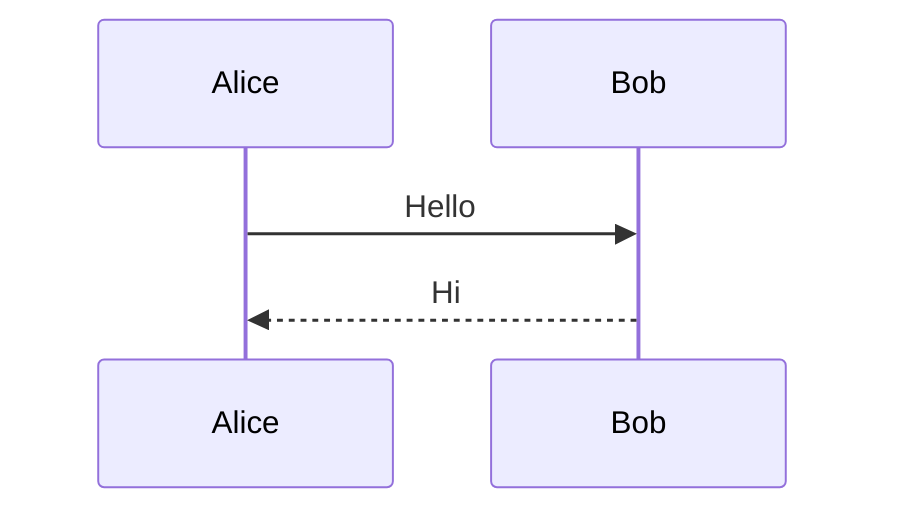
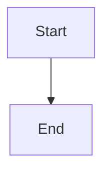
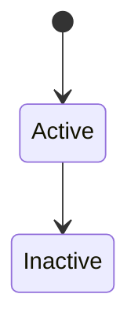

# Test Markdown File

This is a test file for E2E testing.

## Sequence Diagram

```mermaid
sequenceDiagram
    participant Alice
    participant Bob
    Alice->>Bob: Hello
    Bob-->>Alice: Hi
```

## Flowchart

```mermaid
graph TD
    A[Start] --> B[End]
```

Some text between diagrams.

## State Diagram

```mermaid
stateDiagram
    [*] --> Active
    Active --> Inactive
```
