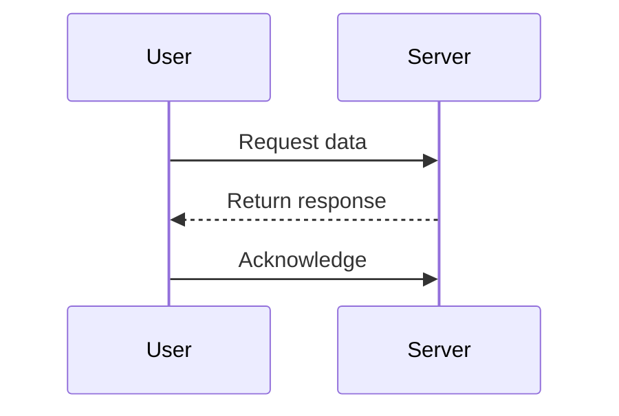
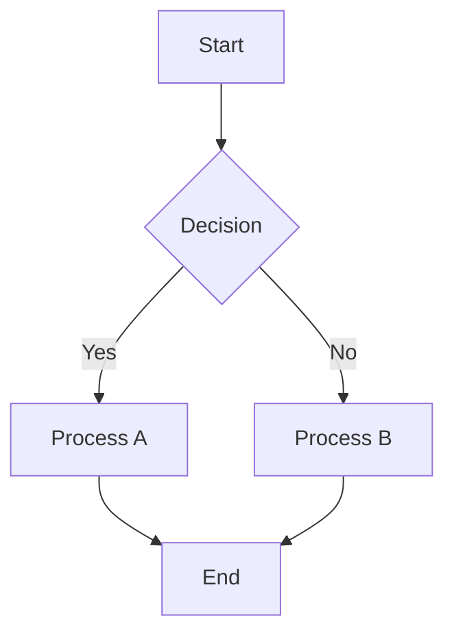
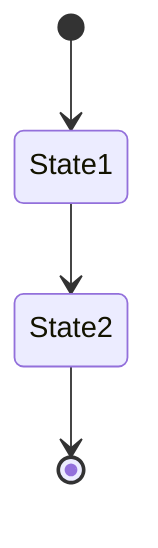
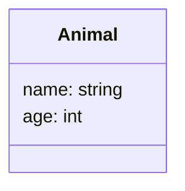

# Test Document for Mermaid Editor

This is a test markdown file used for testing the Mermaid editor extension.

## First Mermaid Diagram - Sequence Diagram



Some text between diagrams.

```javascript
console.log('This is a regular code block, not mermaid');
```

## Second Mermaid Diagram - Flowchart



## Third Mermaid Diagram - State Diagram



Some final text.


