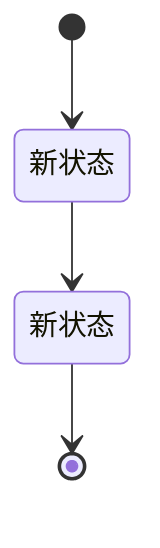
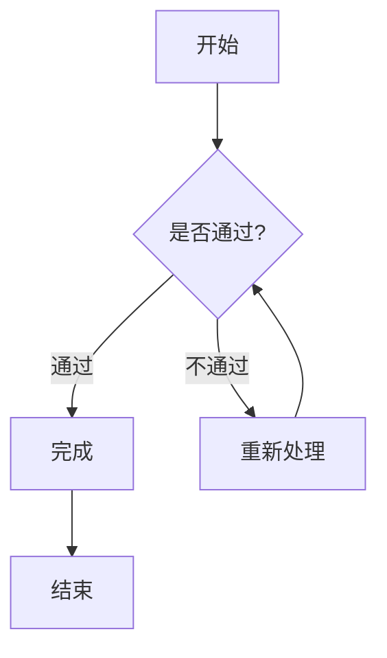
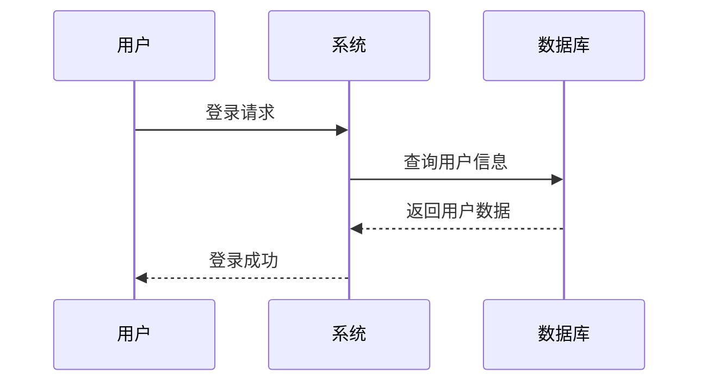
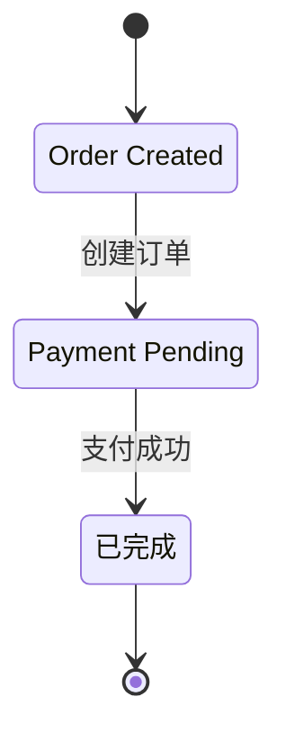

# 中文支持测试

## 状态图 - 你的原始示例

```mermaid
stateDiagram-v2
    state "新状态" as 下单
    state 新状态
    [*] --> 下单
    下单 --> 新状态
    新状态 --> [*]
```

## 流程图示例

```mermaid
flowchart TB
    开始[开始] --> 处理{是否通过?}
    处理 -->|通过| 完成[完成]
    处理 -->|不通过| 重试[重新处理]
    重试 --> 处理
    完成 --> 结束[结束]
```

## 时序图示例

```mermaid
sequenceDiagram
    participant 用户
    participant 系统
    participant 数据库
    
    用户->>系统: 登录请求
    系统->>数据库: 查询用户信息
    数据库-->>系统: 返回用户数据
    系统-->>用户: 登录成功
```

## 混合中英文

```mermaid
stateDiagram-v2
    state "Order Created" as 下单
    state "Payment Pending" as 待支付
    state "已完成" as completed
    
    [*] --> 下单
    下单 --> 待支付: 创建订单
    待支付 --> completed: 支付成功
    completed --> [*]
```
