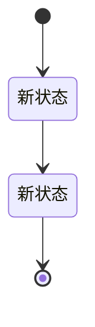
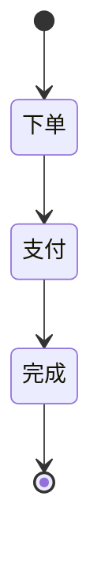
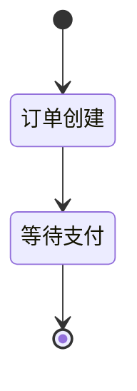

# 测试状态图

## 你的示例

```mermaid
stateDiagram-v2
    state "新状态" as 下单
    state 新状态
    [*] --> 下单
    下单 --> 新状态
    新状态 --> [*]
```

## 标准语法示例

```mermaid
stateDiagram-v2
    [*] --> 下单
    下单 --> 支付
    支付 --> 完成
    完成 --> [*]
```

## 带别名的语法

```mermaid
stateDiagram-v2
    state "订单创建" as 下单
    state "等待支付" as 支付
    [*] --> 下单
    下单 --> 支付
    支付 --> [*]
```
