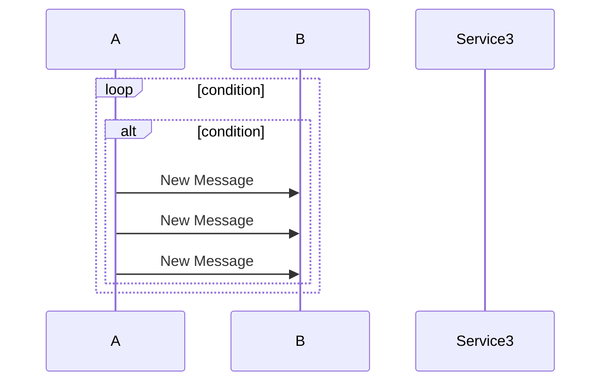
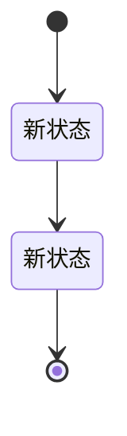
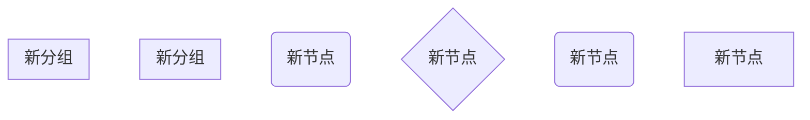

#test

```mermaid
sequenceDiagram
    participant A
    participant B
    participant Service3
    loop condition
        alt condition
            A->>B: New Message
            A->>B: New Message
            A->>B: New Message
        end
    end
```

```mermaid
stateDiagram-v2
    state "新状态" as 下单
    state 新状态
    [*] --> 下单
    下单 --> 新状态
    新状态 --> [*]
```

```mermaid
flowchart TB

node_1770884855908("新节点")
node_1770884868787{"新节点"}
node_1770884871632("新节点")
node_1770884875921["新节点"]

subgraph subgraph_1770879251759["新分组"]
end
subgraph subgraph_1770884881788["新分组"]
end
```